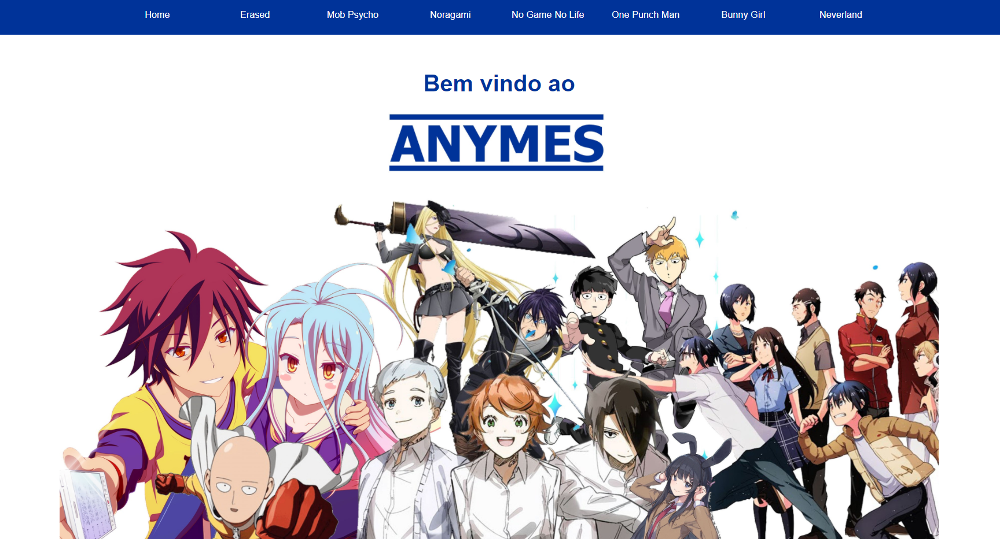
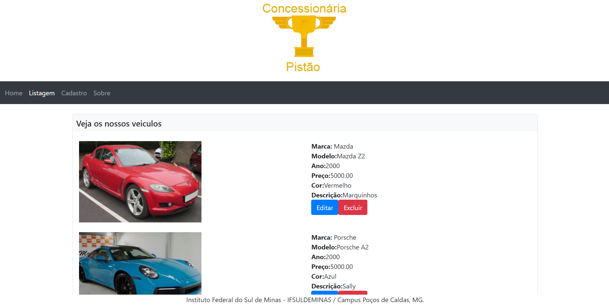
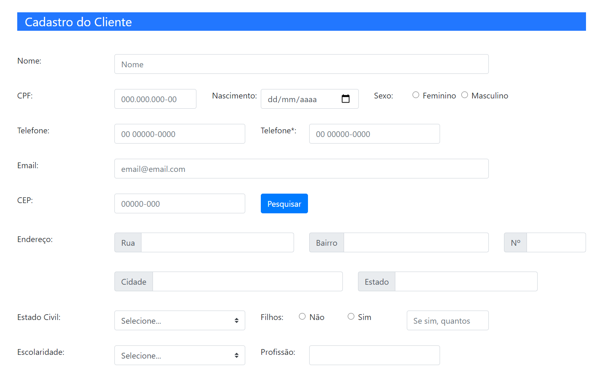
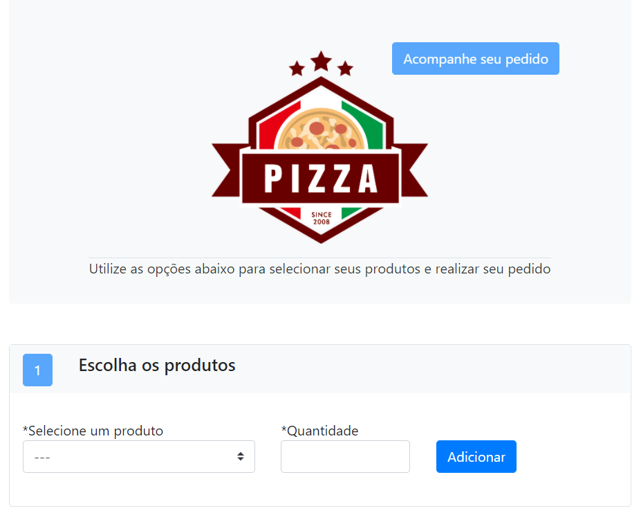
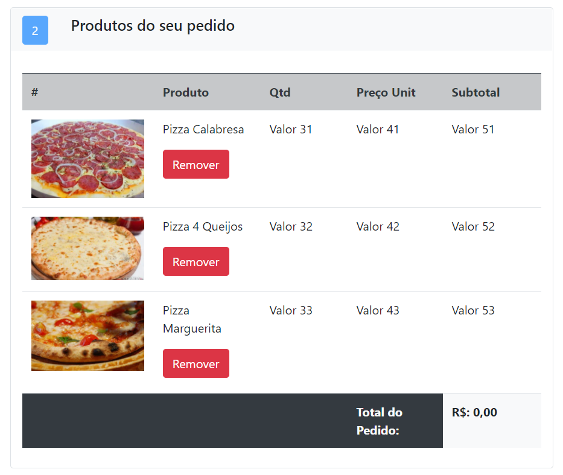
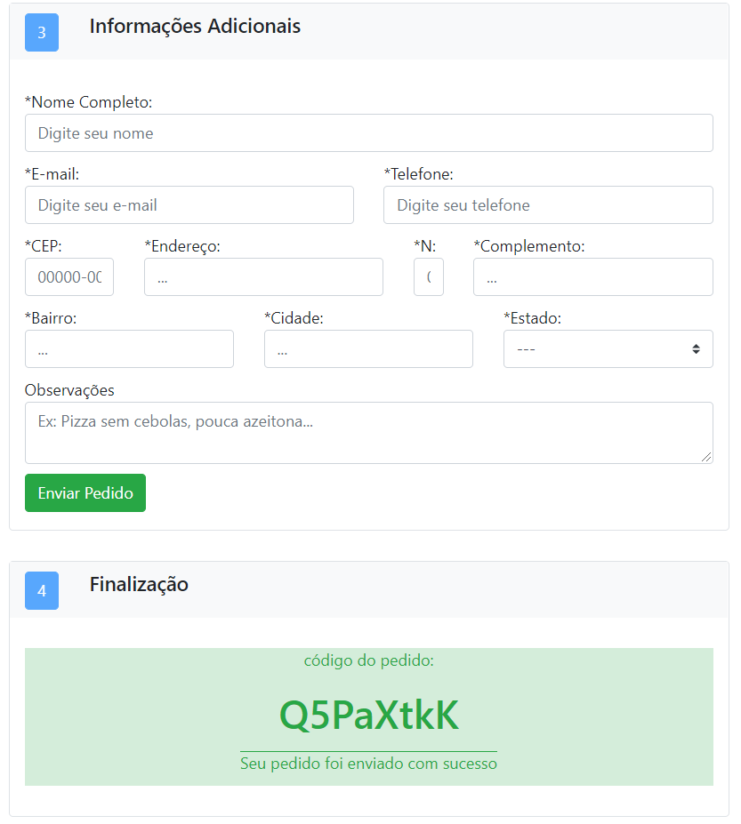

<h1>Todos os Sites Criado em Web 1</h1>
Trabalhos entregues ao longo da semestre na disciplina de Programação Web 1, 
Concluido no IFSULDEMINAS - Campus Poços de Caldas.

<h1>Tecnologias utilizadas</h1>
<ul>
	<li>HTML</li>
	<li>CSS</li>
	<li>Javascript</li>
	<li>Bootstrap</li>
</ul>

<h1>Sites Criados</h1>
<h2>Site Pessoal</h2>
Site Pessoal, utilizando apenas HTML e CSS, totalmente responsivel. O Trabalho precisava conter várias informações pessoais, como 
Hobbys e Sites Favoritos, apenas para introduzir o uso de HTML e CSS.  

<h2>Site Anime</h2>
Site criado utilizando HTML e CSS, utilizado para o trabalho interdisciplinar com IA, onde fizemos um buscador em php, o site
possui muitas páginas, mas com pouco conteúdo, e vários iframes um certo site de anime.

A imagem da página inicial foi criada por mim utilizando o Photoshop.

<h2>Site JavaScript</h2>
Site de uma concessionária, utilizando HTML, CSS e JavaScript, utilizando o recurso de Local Storage. O site possui um formulário para cadastrar os carros e uma página de listagem, onde é possivel editar ou excluir carros já cadastrados.

<h2>Site Bootstrap</h2>
O objetivo dos trabalhos de bootstrap era apenas fazer com que as páginas criadas fossem identicas as imagens postadas pelo professor, portanto elas não possui funcionalidade alguma.
 <b> site 1 (bootstrap.html) </b>

 <b> site 2 (pizzaria.html) </b>

